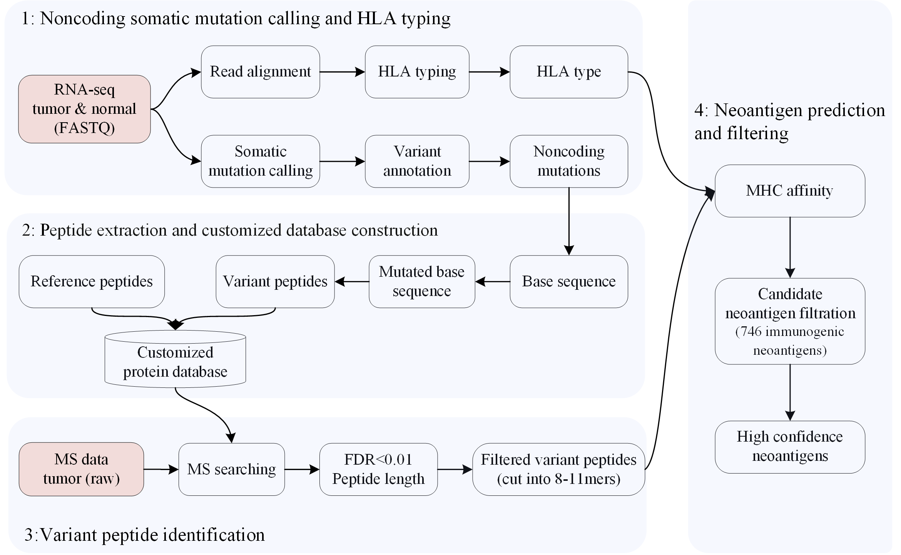

# PGNneo
PGNneo: a ProteoGenomics-based Neoantigen Prediction Pipeline in Noncoding Regions

## Overview of PGNneo pipeline

## 1. Introduction
PGNneo is a proteogenomics-based pipeline to predict neoantigens in noncoding regions. It mainly includes four modules: (1) Noncoding somatic variant calling and HLA typing; (2) Peptide extraction and customized database construction; (3) Variant peptide identification; (4) Neoantigen prediction and selection. PGNneo can be easily applied to RNA-seq data and MS data from patients of different cancer types. 

## 2.	Running environment
PGNneo requires a Linux operation system (centos7) with Python (V3.8), R (V4.0), Perl (V5.16) and Java (V1.7) installed.

## 3.	Usage
Run the following codes before getting started.
```
cd PGNneo
bash start.sh
```
### 3.1. Noncoding somatic variant calling and HLA typing
```
python model1_rnaseq_mutation_hla.py control_name_R1.fastq.gz control_name_R2.fastq.gz case_name_R1.fastq.gz case_name_R2.fastq.gz
# eg:
python model1_rnaseq_mutation_hla.py con_R1.fastq.gz con_R2.fastq.gz case_R1.fastq.gz case_R2.fastq.gz

```
The results of RNAseq data preprocessing, call mutation and HLA typing are in the “rna_result”, “mut_result” and “HLAtype” folders, respectively.

### 3.2. Generation of tumor-specific variant peptides
```
python model2_mutated_peptides.py control_name_R1.fastq.gz case_name_R1.fastq.gz
# eg:
python model2_mutated_peptides.py con_R1.fastq.gz case_R1.fastq.gz
```
The results of the generated mutant peptides are under the “mut_result” folder.

### 3.3. Database construction and variant peptide identification 
```
python model3_MS_filtration.py
```
The result files will be stored under the “ms_resultmqpar/combined/txt” folder.

### 3.4. Neoantigen prediction and selection
```
python model4_neoantigen_prediction_filtration.py
```
**notes:**
Input the HLA types predicted in 3.1 or other types that the user interested in when the system prompts:
"please input an HLA class I allele like 'HLA-A02:01' or multiple alleles like 'HLA-A02:01,HLA-B15:01,HLA-C01:02':".

Neoantigen predictions and filtering results will be stored in the “preneo” directory.

For detailed software installation and usage of PGNneo, please read the User's Manual.

